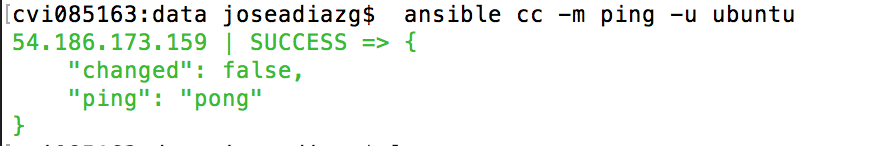
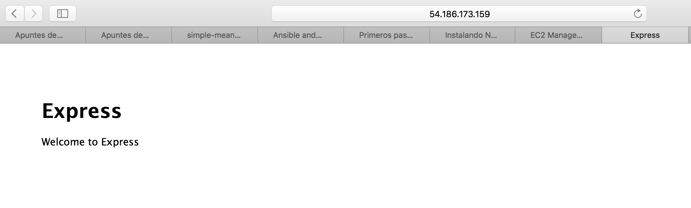

#Ejercícios del tema 2 de Cloud Computing

##Ejercício 1: Instalar chef en la máquina virtual que vayamos a usar.

Para instalar chef en local (workstation) usamos el siguiente comando abriendo una terminal.

```
  curl -L https://www.opscode.com/chef/install.sh | sudo bash
```
Tras lo cual tendremos el siguiente resultado que nos indica que Chef está instalado.


Para instalar chef en la máquina virtual que vamos a usar, simplemente tenremos que levantar la instancia, conectar por ssh y ejecutar el mismo comando que hemos visto anteriormente, teniendo en cuenta que para acceder como superusuario en la máquina virtual podremos usar el siguiente comando si no conocemos la contraseña como es el caso de una máquina virtual de Amazon AWS,  AMI EC2.

```
  sudo su -
```

Tras esto podemos ver el siguiente resultado que nos indica que está bien instalado.


##Ejercicio 2: Crear una receta para instalar nginx, tu editor favorito y algún directorio y fichero que uses de forma habitual.

Lo primero que debemos realizar es crear la estructura de directorios y los ficheros necesarios para que chef funcione correctamente. Esta estructura es la que podemos ver en la siguiente imagen:


El contenido de los archivos sería el siguiente:

  -Para la receta de emacs, junto con la creación de un directorio y un documento:

```
package 'emacs'
directory '/home/ubuntu/CC'
file "/home/ubuntu/CC/LEEME" do
      owner "ubuntu"
      group "ubuntu"
      mode 00544
      action :create
      content "Directorio para documentos diversos de la asignatura Cloud Computing del master profesional en ingeniería informática"
end
```
  -Para la receta de nginx:

```
package 'nginx'

```

El mientras que el fichero ``solo.rb`` y ``node.json`` serían:

```
file_cache_path "/home/ubuntu/chef"
cookbook_path "/home/ubuntu/chef/cookbooks"
json_attribs "/home/ubuntu/chef/node.json"

```  
Tras esto podemos ejecutar el siguiente comando estando situandos dentro del directorio chef:

```
sudo chef-solo -c solo.rb

```

Lo que ejecutará las recetas e instalará los paquetes como podemos ver en la siguiente captura de pantalla.


##Ejercicio 3: Escribir en YAML la siguiente estructura de datos en en JSON { uno: "dos",tres: [ 4, 5, "Seis", { siete: 8, nueve: [ 10, 11 ] }

```
  ---
    uno: "dos"
    tres:
        4
        5
        "Seis"
        siete: 8
        nueve
            10
            11
```


##Ejercicio 5: Desplegar los fuentes de una aplicación cualquiera, propia o libre, que se encuentre en un servidor git público en la máquina virtual Azure (o una máquina virtual local) usando ansible.


Para ello lo primero es instalar en nuestra máquina virtual ansible y los demás paquetes relacionados con phyton necesarios. 

Por defecto en Mac OS X no tenemos pip por lo que será necesario instalarlo antes de nada para ello usamos:

``sudo easy_install pip``

Tras esto debemos instalar los paquetes anteriormente mencionados, para ello utilizamos el siguiente comando. 

```sudo pip install paramiko PyYAML jinja2 httplib2 ansible```

Una vez hecho esto creamos dentro de ``/etc`` un directorio para ubicar los ficheros que ansible usará a este lo denominaremos como ``/etc/ansible``. Dentro de este ubicaremos un fichero denominado hosts y en el introduciremos los datos de nuestra instacia y la dirección de la clave ssh que hemos generado al configurar el keypair de AWS. 

```
[cc]

54.186.173.159 private_key_file=/Users/joseadiazg/.ssh/cckey.pem

```

Tras esto debemos crear otro fichero de configuración dentro de ``/etc/ansible/`` denominado ``ansible.dfg`` en el introducimos lo siguiente:


```
[defaults]

private_key_file=/Users/joseadiazg/.ssh/cckey.pem

```

Una vez en este punto podemos introducir el siguiente comando para realizar un ping a la máquina virtual y ver si todo esta correcto.

``ansible cc -m ping -u ubuntu``

Tras lo cual veremos lo siguiente:




Ahora ya podemos desplegar la aplicación para ello dado que no tenemos ninguna aplicación de prueba y el proyecto de la asignatura está basado en MEAN stack, usaremos express generator para crear una aplicación de prueba y conectar con ella. Para ello lo primero será crearnos la apliación de prueba en un repositorio aparte de github. 

1. Instalamos express-generator para ello usamos el siguiente comando ``npm install express-generator -g``.
2. Tras esto ejecutamos el comando ``express myapp`` que nos creara todo lo necesario para ejecutar la aplicación. 
3. El siguiente paso es instalar las dependencias para ello entramos dentro del directorio y introducimos `` npm install``.
4. Tras esto podemos ejecutar la aplicacion, en mi caso que uso Mac OS X lo hacemos con el comando, ``DEBUG=myapp:* npm start``.
5. El siguiente paso es acceder a a la aplicacion que se ejecuta por defecto en el puerto 3000. asi que accedemos a ``localhost:3000``. Con lo que veremos el resultado de la app. 

Para poder llevar a cabo esto lo primero que debemos realizar es instalar los paquetes que usaremos si no estan previamente provisionados, esto podemos hacerlo con los siguientes comandos:

```
ansible cc -u ubuntu  -m shell -a "sudo apt-get install nodejs npm -y"
ansible cc -u ubuntu  -m shell -a "sudo npm install express-generator -g"
```

Tras esto copiamos nuestra aplicación de github con el comando:

```
ansible cc -u ubuntu -m git -a "repo=https://github.com/joseangeldiazg/express-app.git  dest=~/pruebaExpress version=HEAD"
```

Ahora solo tenemos que instalar las dependencias en caso de no estar instaladas para ello entramos en el directorio y ejecutamos el comando ``npm install``.

```
ansible cc -u ubuntu  -m shell -a "cd ~/pruebaExpress && npm install"
```

Tras esto ejecutamos la aplicacion introduciendo el comando que hemos visto anteriormente con ansible y tendremos el siguiente resultado. 




Tenemos que tener en cuenta que antes de todo esto deberemos haber liberado el puerto 3000 en AWS. 

##Ejercicio 6: Desplegar la aplicación que se haya usado anteriormente con todos los módulos necesarios usando un playbook de Ansible.


 
En este caso instalaremos los paquetes necesarios y ejecutaremos el comando que nos creará la app de prueba con un Playbook de Ansible. El playbook usado es el sigueinte:


```
-hosts: cc
  sudo: yes
  remote_user: ubuntu
  tasks:
  - name: Instalar paquetes necesarios
      apt: name=nodejs state=present
      apt: name=npm state=present
      apt: name=git state=present
  - name: Crear aplicacion
      command: express --view=jade myapp
  - name: Instalar dependencias
      command: cd myapp && npm install
  - name: ejecutar
      command: cd myapp &&  sudo DEBUG=myapp:* npm start
      
```

Tras esto ejecutamos el Playbook con el comando:

```ansible-playbook -i hosts playbook.yml```

 
 


