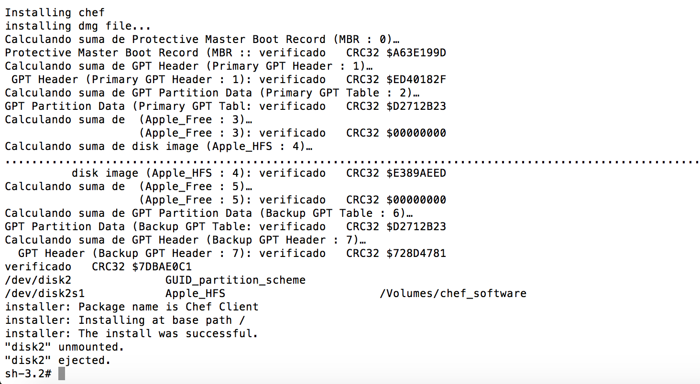
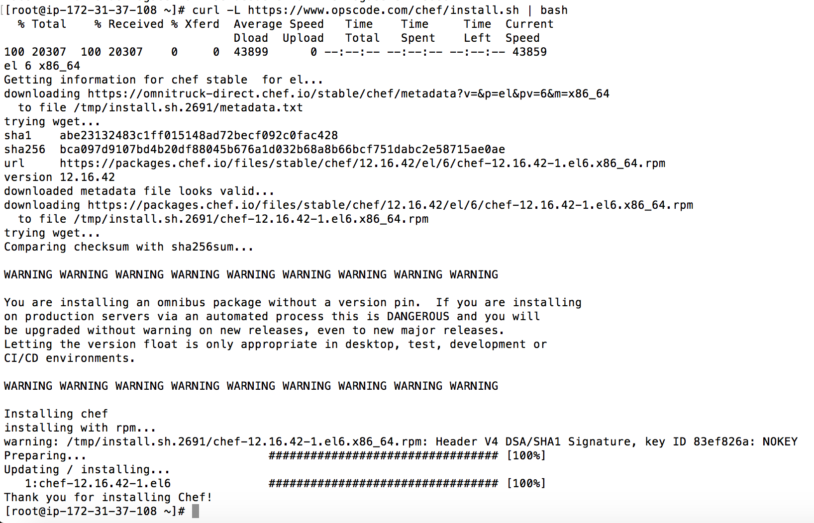
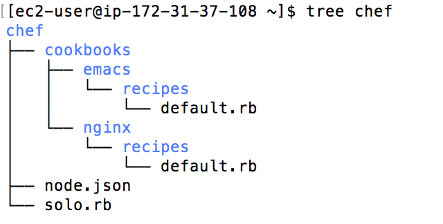
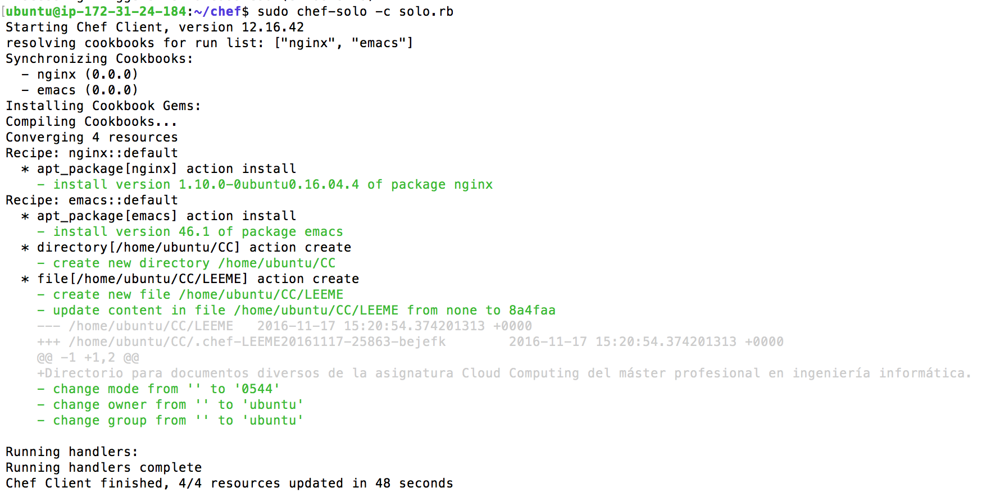

#Ejercícios del tema 2 de Cloud Computing

##Ejercício 1: Instalar chef en la máquina virtual que vayamos a usar.

Para instalar chef en local (workstation) usamos el siguiente comando abriendo una terminal.

```
  curl -L https://www.opscode.com/chef/install.sh | sudo bash
```
Tras lo cual tendremos el siguiente resultado que nos indica que Chef está instalado.




Para instalar chef en la máquina virtual que vamos a usar, simplemente tenremos que levantar la instancia, conectar por ssh y ejecutar el mismo comando que hemos visto anteriormente, teniendo en cuenta que para acceder como superusuario en la máquina virtual podremos usar el siguiente comando si no conocemos la contraseña como es el caso de una máquina virtual de Amazon AWS,  AMI EC2.

```
  sudo su -
```

Tras esto podemos ver el siguiente resultado que nos indica que está bien instalado.




##Ejercicio 2: Crear una receta para instalar nginx, tu editor favorito y algún directorio y fichero que uses de forma habitual.

Lo primero que debemos realizar es crear la estructura de directorios y los ficheros necesarios para que chef funcione correctamente. Esta estructura es la que podemos ver en la siguiente imagen:



El contenido de los archivos sería el siguiente:

  -Para la receta de emacs, junto con la creación de un directorio y un documento:

```
package 'emacs'
directory '/home/ubuntu/CC'
file "/home/ubuntu/CC/LEEME" do
      owner "ubuntu"
      group "ubuntu"
      mode 00544
      action :create
      content "Directorio para documentos diversos de la asignatura Cloud Computing del master profesional en ingeniería informática"
end
```
  -Para la receta de nginx:

```
package 'nginx'

```

El mientras que el fichero "solo.rb" y "node.json" serían:

```
file_cache_path "/home/ubuntu/chef"
cookbook_path "/home/ubuntu/chef/cookbooks"
json_attribs "/home/ubuntu/chef/node.json"

```  
Tras esto podemos ejecutar el siguiente comando estando situandos dentro del directorio chef:

```
sudo chef-solo -c solo.rb

```

Lo que ejecutará las recetas e instalará los paquetes como podemos ver en la siguiente captura de pantalla.



##Ejercicio 3: Escribir en YAML la siguiente estructura de datos en en JSON { uno: "dos",tres: [ 4, 5, "Seis", { siete: 8, nueve: [ 10, 11 ] }

```
  ---
    uno: "dos"
    tres:
        4
        5
        "Seis"
        siete: 8
        nueve
            10
            11
```
