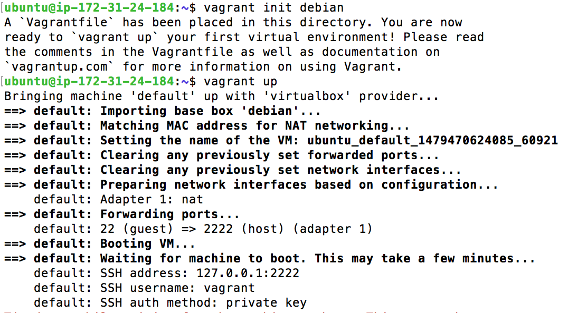

##Ejercicio 1: Instalar una máquina virtual Debian usando Vagrant y conectar con ella.


El primer paso será instalar Vagrant en nuestro workstation. Para ello podemos hacerlo mediante terminal o en mi caso al usar sistema operativo Mac OSX simplemente descargado el pkg de la web del producto e instalandolo. Tras ese punto debemos obtener una imagen debian ``.box`` para ello podemos encontrar varias [en esta web.](http://www.vagrantbox.es ).

Una vez elegida la imagen la descargamos y añadimos a Vagrant con el comando:

``vagrant box add debian https://github.com/holms/vagrant-jessie-box/releases/download/Jessie-v0.1/Debian-jessie-amd64-netboot.box``

Tras esto podremos ver que la imagen ha sido descargada y añadida correctamente en la siguiente imagen:


El paso siguiente será levantar la máquina virtual para ello primero debemos instalar Virtualbox si no lo tenemos ya instalado ya que Vagrant trabaja principalmente bajo esta plataforma de virtualización.

Tras eso ejecutamos los siguientes comandos

```vagrant init debian```

``` vagrant up```

Con lo que levantaremos la máquina virtual, momento tras el cual podremos ver que todo ha ido correctamente. 



Tras esto solo queda conectar por ssh con ``vagrant ssh``.


##Ejercicio 2: Instalar una máquina virtual ArchLinux o FreeBSD para KVM, otro hipervisor libre, usando Vagrant y conectar con ella. 

Para poder trabajar con este tipo de máquinas debemos primero instalar ciertos plugin adicionales en función del hipervisor que vayamos a usar, por ejemplo para usar libvirt primero debemos instalar QEMU. Para ello en Mac, primero actualizamos homebrew con el siguiente comando: 


	/usr/bin/ruby -e "$(curl -fsSL https://raw.githubusercontent.com/Homebrew/install/master/install)
 

Tras esto instalamos el compilador que QEMU necesita así como el paquete pkg-config necesario. Para ello ejecutamos los comandos:


```

brew install https://raw.github.com/Homebrew/homebrew-dupes/master/apple-gcc42.rb

brew install pkg-config

```

Por último instalamos QEMU, teniendo en cuenta que es un comando que puede tardar varios minutos. 

```
brew install qemu --env=std --cc=gcc-4.2

```


## Ejercicio 3: Crear un script para provisionar `nginx` o cualquier otro servidor web que pueda ser útil para alguna otra práctica.

Para crear el servidor web necesitariamos este script de Vagrant, en el que especificamos en script de provisionamiento que usaremos en la parte final. 

```
Vagrant.configure("2") do |config|
	config.vm.box = "primalskill/ubuntu-trusty64"
	config.vm.network :forwarded_port, guest: 80, host: 8931, auto_correct: true
	config.vm.synced_folder "./", "/var/www", create: true, group: "www-data", owner: "www-data"
	
	config.vm.provider "virtualbox" do |v|
    v.name = "SitePoint Test Vagrant"
    v.customize ["modifyvm", :id, "--memory", "1024"]
	end
	
	config.vm.provision "shell" do |s|
    s.path "provision/setup.sh"
	end
end

```

Deberemos por tanto de ubicar en el directorio de trabajo un nuevo directorio provisión que alojará nuestro script de provisionamiento shell. Este script podemos encontrarlo a continuación. 

```
#!/bin/bash

echo "Instalando servidor web..."

echo "Instalando GIT"
    apt-get install git -y > /dev/null
    
    echo "Instalando NGINX"
    apt-get install nginx -y > /dev/null

```

## Ejercicio 4: Configurar tu máquina virtual usando `vagrant` con el provisionador ansible.

Este ejercício ha sido resuelto en el [hito 3 de la asignatura](https://github.com/joseangeldiazg/MII-CloudComputing/issues/10). Deberemos crear un fichero Vagrantfile con el siguiente contenido por ejemplo:

```
# -*- mode: ruby -*-
# vi: set ft=ruby :

# All Vagrant configuration is done below. The "2" in Vagrant.configure
# configures the configuration version (we support older styles for
# backwards compatibility). Please don't change it unless you know what
# you're doing.
Vagrant.configure(2) do |config|

	config.vm.define :almacenamiento do |almacenamiento|
		almacenamiento.vm.host_name = "users"
		almacenamiento.vm.provider :aws do |aws, override|
			aws.access_key_id = ENV['AWS_KEY']
			aws.secret_access_key = ENV['AWS_SECRET']
			aws.keypair_name = ENV['AWS_KEYNAME']

			aws.ami = "ami-01f05461"
			aws.region = "us-west-2"
			aws.instance_type = "t2.micro"
			aws.security_groups = ["cc"]

			override.vm.box = "dummy"
			override.ssh.username = "ubuntu"
			override.ssh.private_key_path = ENV['AWS_KEYPATH']
		end
		almacenamiento.vm.provision "ansible" do |ansible|
			ansible.playbook = "mean.yml"
		end
	end

	config.vm.define :tareas do |tareas|
		tareas.vm.host_name = "events"
		tareas.vm.provider :aws do |aws, override|
			aws.access_key_id = ENV['AWS_KEY']
			aws.secret_access_key = ENV['AWS_SECRET']
			aws.keypair_name = ENV['AWS_KEYNAME']

			aws.ami = "ami-01f05461"
			aws.region = "us-west-2"
			aws.instance_type = "t2.micro"
			aws.security_groups = ["cc"]

			override.vm.box = "dummy"
			override.ssh.username = "ubuntu"
			override.ssh.private_key_path = ENV['AWS_KEYPATH']
		end
		tareas.vm.provision "ansible" do |ansible|
			ansible.playbook = "mean.yml"
		end
	end

  config.vm.define :roles do |roles|
		roles.vm.host_name = "events"
		roles.vm.provider :aws do |aws, override|
			aws.access_key_id = ENV['AWS_KEY']
			aws.secret_access_key = ENV['AWS_SECRET']
			aws.keypair_name = ENV['AWS_KEYNAME']

			aws.ami = "ami-01f05461"
			aws.region = "us-west-2"
			aws.instance_type = "t2.micro"
			aws.security_groups = ["cc"]

			override.vm.box = "dummy"
			override.ssh.username = "ubuntu"
			override.ssh.private_key_path = ENV['AWS_KEYPATH']
		end
		roles.vm.provision "ansible" do |ansible|
			ansible.playbook = "mean.yml"
		end
	end

end

```

Para poder ejecutarlo en este caso realizado en  una instacia Amazon EC2, debemos hacer un export de cada una de las variables de entorno vistas en el anterior script. Para evitar tener que introducir continuadamente los datos podemos incluirlos en el fichero ``.profile``. 

Dentro del mismo directorio donde tenemos este fichero, debemos alojar el playbook de Ansible y el fichero ansible.cfg con la ruta de la clave de nuestra máquina para que la conexión por ssh para aprovisionar no de ningun error. 


