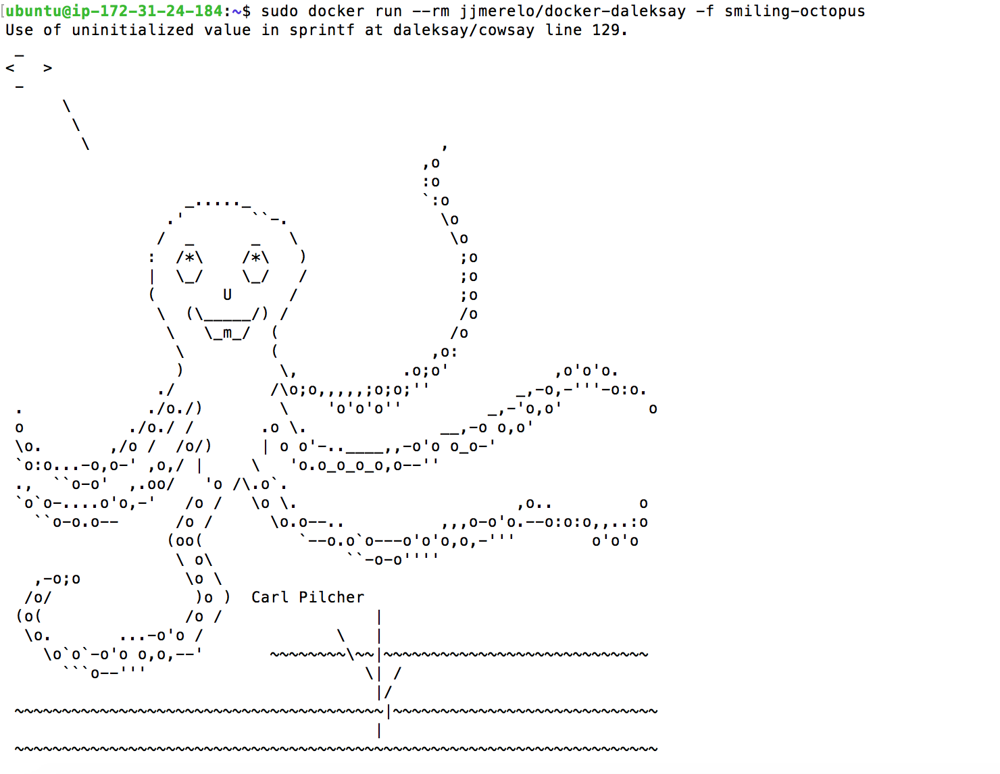
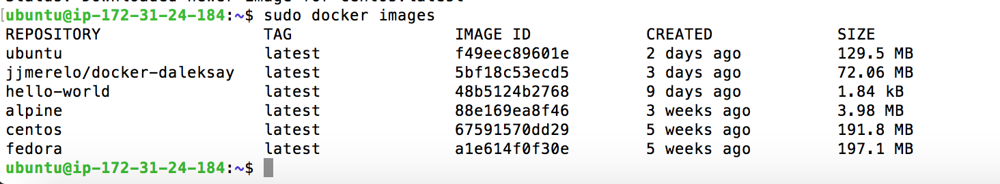

## Ejercicio 1:Instala LXC en tu versión de Linux favorita. Normalmente la versión en desarrollo, disponible tanto en GitHub como en el sitio web está bastante más avanzada; para evitar problemas sobre todo con las herramientas que vamos a ver más adelante, conviene que te instales la última versión y si es posible una igual o mayor a la 2.0.

Para instalar LXC podemos usar el siguiente comando:

	sudo apt install lxc
	
Con ello instalaremos la última versión tal y como vemos en el siguiente pantallazo. 

## Ejercicio 2: Instalar una distro tal como Alpine y conectarse a ella usando el nombre de usuario y clave que indicará en su creación.

Para instalar Alpine usamos usamos el comando:

	sudo lxc-create -t alpine -n CC
	
Tras esto obtendremos el resultado:

Tras ello podemo iniciar la máquina y conectarnos a ella usando el siguiente comando:

	sudo lxc-start -n CC
	sudo lxc-attach -n CC
	
El resultado es el siguiente:

	

	
## Ejercicio 4: Buscar alguna demo interesante de Docker y ejecutarla localmente, o en su defecto, ejecutar la imagen anterior y ver cómo funciona y los procesos que se llevan a cabo la primera vez que se ejecuta y las siguientes ocasiones.

Ejecutamos el comando:

	sudo docker run --rm jjmerelo/docker-daleksay -f smiling-octopus

La primera vez que lo ejecutamos podemos ver lo siguiente:

De esta imagen vemos como en la primera ejecución, no encuentra la imagen y por tanto la baja de un repositorio en Docker Hub. Realiza el pull y por tanto luego la ejecuta. El la siguiente imagen podemos ver como estos pasos ya los ignora. 

## Ejercicio 5: Comparar el tamaño de las imágenes de diferentes sistemas operativos base, Fedora, CentOS y Alpine, por ejemplo.

El primer paso es instalar algunas imágenes para ello podemos usar:

	sudo docker pull alpine
	sudo docker pull ubuntu
	sudo docker pull fedora
	sudo docker pull centos
	
Una vez instaladas todas podemos ver su tamaño con tan solo listarlas. 

	sudo docker images
	
El resultado es el siguiente:

	

Vemos como Alpine es la más ligera, siendo la diferencia frente a las demás muy importante. 

