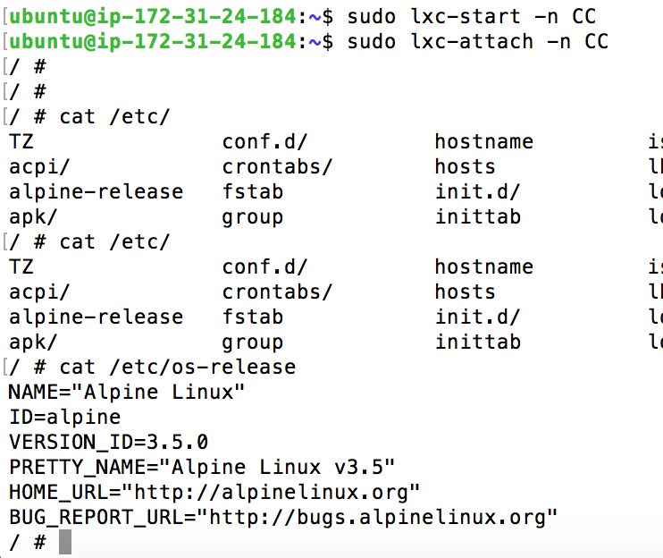

## Ejercicio 1:Instala LXC en tu versión de Linux favorita. Normalmente la versión en desarrollo, disponible tanto en GitHub como en el sitio web está bastante más avanzada; para evitar problemas sobre todo con las herramientas que vamos a ver más adelante, conviene que te instales la última versión y si es posible una igual o mayor a la 2.0.

Para instalar LXC podemos usar el siguiente comando:

	sudo apt install lxc
	
Con ello instalaremos la última versión tal y como vemos en el siguiente pantallazo. 

## Ejercicio 2: Instalar una distro tal como Alpine y conectarse a ella usando el nombre de usuario y clave que indicará en su creación.

Para instalar Alpine usamos usamos el comando:

	sudo lxc-create -t alpine -n CC
	
Tras esto obtendremos el resultado:

Tras ello podemo iniciar la máquina y conectarnos a ella usando el siguiente comando:

	sudo lxc-start -n CC
	sudo lxc-attach -n CC
	
El resultado es el siguiente:

	

	